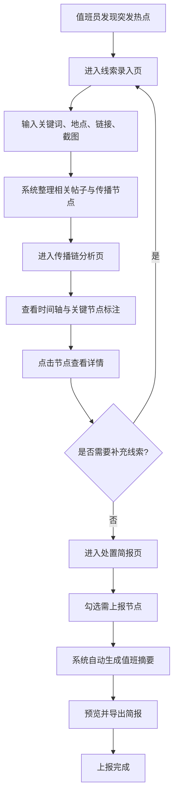

## 1. 产品概述

面向政府舆情值班室的 Web 溯源工作台，用于突发热点出现后的第一小时快速判断"从哪来、谁带起、现在往哪扩散"。系统帮助值班员在夜间轮值、节假日突发事件和跨部门会商前快速统一口径，实现从线索录入到处置简报的闭环工作流。

- 核心目标：将舆情溯源从人工碎片化操作升级为结构化、可视化、可出报的一体化工作流
- 目标用户：政府舆情值班室值班员、舆情分析师、应急管理部门决策者

## 2. 核心功能

### 2.1 用户角色

| 角色 | 进入方式 | 核心权限 |
|------|----------|----------|
| 值班员 | 账号登录 | 录入线索、查看传播链、生成简报 |
| 舆情分析师 | 账号登录 | 全部值班员权限 + 编辑节点标注、调整风险等级 |
| 部门决策者 | 账号登录 | 查看简报、导出上报文档 |

### 2.2 功能模块

1. **热点线索录入页**：关键词输入、疑似事件地点选择、首批链接/截图上传、线索优先级标记
2. **传播链分析页**：传播链时间轴可视化、关键节点标注（最早可见信息/首次大号扩散/评论情绪转折点）、节点详情面板、情绪趋势图
3. **处置简报页**：节点勾选上报、自动生成值班摘要（起源判断/扩散路径/风险等级/建议关注对象）、简报预览与导出

### 2.3 页面详情

| 页面名称 | 模块名称 | 功能描述 |
|----------|----------|----------|
| 热点线索录入页 | 线索表单区 | 输入关键词（支持多关键词）、选择疑似事件地点（省/市）、粘贴首批链接（支持多条）、上传截图（支持多图）、标记线索优先级（紧急/高/中/低） |
| 热点线索录入页 | 历史线索列表 | 展示最近录入的线索卡片，支持快速续录和状态标记 |
| 热点线索录入页 | 实时关联提示 | 根据关键词自动匹配历史相似线索，提示可能的关联事件 |
| 传播链分析页 | 传播链时间轴 | 按发布时间排列的垂直时间轴，标注三类关键节点：最早可见信息（蓝色）、首次大号扩散（橙色）、评论情绪转折点（红色） |
| 传播链分析页 | 节点详情面板 | 点击节点展示：原文摘要、发布账号类型（个人/媒体/政务/大V）、互动量变化折线图、相邻传播来源列表 |
| 传播链分析页 | 情绪趋势图 | 时间轴右侧展示评论情绪变化曲线，标注情绪转折时刻 |
| 传播链分析页 | 传播来源分布 | 饼图/环形图展示各平台传播占比 |
| 处置简报页 | 节点勾选区 | 从传播链中勾选需要上报的关键节点，支持全选/反选 |
| 处置简报页 | 简报预览区 | 自动生成包含：起源判断、扩散路径描述、风险等级（红/橙/黄/蓝）、建议关注对象的值班摘要 |
| 处置简报页 | 导出操作区 | 支持导出为 PDF / Word，一键复制摘要文本 |

## 3. 核心流程

值班员在突发热点出现后，首先进入线索录入页填写关键词、地点和首批链接，系统据此整理相关帖子与传播节点。随后进入传播链分析页，在时间轴上查看关键节点与情绪变化，点击节点深入了解详情。最后进入处置简报页，勾选需上报节点，系统自动生成值班摘要，导出上报。

## 4. 用户界面设计

### 4.1 设计风格

- **主色调**：深蓝灰底色（#0F1923）象征值班室的夜间沉稳氛围，搭配亮青色（#00E5C7）作为强调色传达信息流动感
- **辅助色**：警示红（#FF4757）用于高风险/情绪转折、预警橙（#FFA502）用于大号扩散、信息蓝（#3498DB）用于最早信息节点
- **按钮风格**：圆角微阴影按钮，主操作按钮为亮青色填充，次操作为描边样式
- **字体**：标题使用思源黑体/Noto Sans SC Bold，正文使用 Noto Sans SC Regular，数据/代码使用 JetBrains Mono
- **布局风格**：左侧紧凑导航栏 + 主内容区，时间轴采用垂直居中布局，详情面板右侧滑出
- **图标风格**：线性描边图标，统一 2px 描边宽度，搭配微妙动效

### 4.2 页面设计概览

| 页面名称 | 模块名称 | UI 元素 |
|----------|----------|----------|
| 热点线索录入页 | 线索表单区 | 深色卡片式表单，输入框带微光边框聚焦效果，优先级选择为胶囊按钮组，上传区虚线拖拽框 |
| 热点线索录入页 | 历史线索列表 | 左侧窄栏卡片列表，悬停展开摘要，紧急标记红色圆点脉冲动画 |
| 热点线索录入页 | 实时关联提示 | 底部滑入通知条，半透明磨砂背景 |
| 传播链分析页 | 传播链时间轴 | 垂直时间轴居中，节点为带光晕圆点，三类节点颜色区分，连接线带流向粒子动画 |
| 传播链分析页 | 节点详情面板 | 右侧抽屉式面板，滑入动画，内含互动量迷你折线图 |
| 传播链分析页 | 情绪趋势图 | 时间轴右侧迷你面积图，渐变填充，转折点垂直虚线标注 |
| 传播链分析页 | 传播来源分布 | 右上角小型环形图，悬停显示具体数值 |
| 处置简报页 | 节点勾选区 | 时间轴缩略视图，节点前增加勾选框，选中节点高亮描边 |
| 处置简报页 | 简报预览区 | A4 纸张风格白色卡片，黑色正文，红/橙/黄/蓝色风险标签 |
| 处置简报页 | 导出操作区 | 底部固定操作栏，导出按钮带下载动画 |

### 4.3 响应式设计

- 桌面端优先（1920×1080 及以上），适配 1440×900 笔记本
- 时间轴在窄屏下切换为简化横轴模式
- 详情面板在窄屏下改为底部抽屉

### 4.4 动效设计

- 页面切换：左侧导航高亮滑动指示器
- 时间轴节点：进入视口时逐个淡入 + 轻微上浮
- 节点详情面板：从右侧滑入，带弹簧缓动
- 传播流向粒子：沿连接线方向匀速流动，表示信息扩散方向
- 情绪转折点：脉冲呼吸动画引起注意
- 简报生成：打字机效果逐行显示摘要内容
