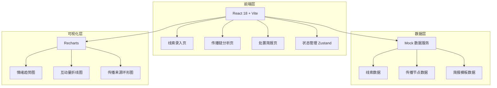
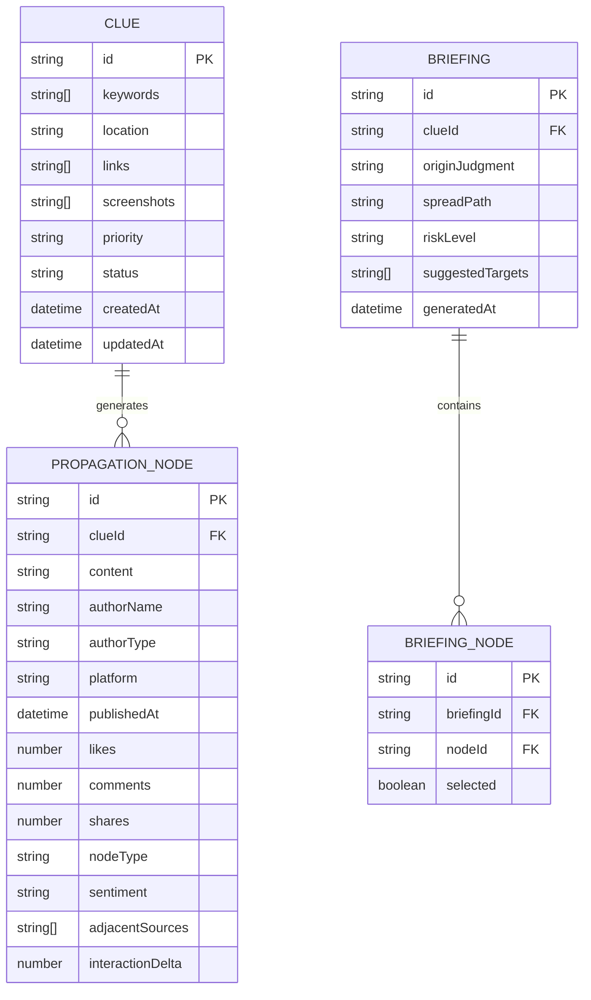

## 1. 架构设计



## 2. 技术说明

- **前端框架**：React 18 + TypeScript
- **构建工具**：Vite
- **样式方案**：Tailwind CSS 3
- **状态管理**：Zustand
- **可视化库**：Recharts
- **路由方案**：React Router v6
- **动画方案**：Framer Motion
- **图标库**：Lucide React
- **数据方案**：Mock 数据，前端本地存储（localStorage），无需后端服务
- **初始化工具**：vite-init

## 3. 路由定义

| 路由 | 用途 |
|------|------|
| `/` | 重定向到线索录入页 |
| `/clue-entry` | 热点线索录入页 |
| `/propagation` | 传播链分析页 |
| `/briefing` | 处置简报页 |

## 4. 数据模型

### 4.1 数据模型定义



### 4.2 数据定义

**线索优先级枚举**：
- `urgent`：紧急
- `high`：高
- `medium`：中
- `low`：低

**传播节点类型枚举**：
- `earliest`：最早可见信息
- `amplifier`：首次大号扩散
- `sentiment_turn`：评论情绪转折点
- `normal`：普通节点

**发布账号类型枚举**：
- `personal`：个人
- `media`：媒体
- `government`：政务
- `influencer`：大V

**风险等级枚举**：
- `red`：红色（重大）
- `orange`：橙色（较大）
- `yellow`：黄色（一般）
- `blue`：蓝色（轻微）

**情绪标签枚举**：
- `positive`：正面
- `neutral`：中性
- `negative`：负面
- `mixed`：混合

## 5. 关键交互逻辑

### 5.1 线索录入 → 传播链生成

用户录入关键词和链接后，系统基于 Mock 数据模拟生成传播节点序列，按发布时间排序，自动识别三类关键节点并标注。

### 5.2 传播链节点交互

点击时间轴节点，右侧抽屉展示详情面板，包含：
- 原文摘要（最多 200 字）
- 发布账号信息（名称 + 类型标签）
- 互动量变化迷你折线图
- 相邻传播来源列表（可点击跳转）

### 5.3 简报自动生成

用户在简报页勾选节点后，系统根据选中节点的类型、时间和关联关系，自动填充：
- 起源判断：基于最早可见信息节点
- 扩散路径：基于节点时间序列和大号扩散节点
- 风险等级：基于情绪转折点数量和负面情绪占比
- 建议关注对象：基于大号扩散节点账号列表

## 6. 项目目录结构

```
src/
├── components/
│   ├── layout/
│   │   ├── Sidebar.tsx
│   │   └── PageWrapper.tsx
│   ├── clue-entry/
│   │   ├── ClueForm.tsx
│   │   ├── HistoryList.tsx
│   │   └── RelatedHint.tsx
│   ├── propagation/
│   │   ├── Timeline.tsx
│   │   ├── TimelineNode.tsx
│   │   ├── DetailPanel.tsx
│   │   ├── SentimentChart.tsx
│   │   └── SourceChart.tsx
│   ├── briefing/
│   │   ├── NodeSelector.tsx
│   │   ├── BriefingPreview.tsx
│   │   └── ExportBar.tsx
│   └── ui/
│       ├── Button.tsx
│       ├── Input.tsx
│       ├── Card.tsx
│       ├── Badge.tsx
│       ├── Select.tsx
│       └── Drawer.tsx
├── pages/
│   ├── ClueEntryPage.tsx
│   ├── PropagationPage.tsx
│   └── BriefingPage.tsx
├── store/
│   ├── clueStore.ts
│   ├── propagationStore.ts
│   └── briefingStore.ts
├── data/
│   └── mockData.ts
├── types/
│   └── index.ts
├── utils/
│   └── helpers.ts
├── App.tsx
├── main.tsx
└── index.css
```
